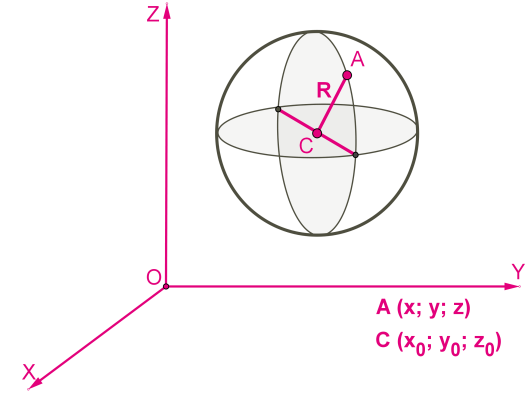

Build & Run
===========

Linux
-----

```zsh
mkdir BUILD
cd BUILD
cmake ..
make
./test_task
../PointVisualizer_linux64 ./test.asc
```


Math
====



If the point lies on the turning point of the sphere
----------------------------------------------------

R<sup>2</sup> = (x<sub>A</sub> + x<sub>C</sub>)<sup>2</sup> + (y<sub>A</sub> + y<sub>C</sub>) + (z<sub>A</sub> + z<sub>C</sub>)

If the point is in the middle of the sphere
-------------------------------------------

R<sup>2</sup> > (x + x<sub>C</sub>)<sup>2</sup> + (y + y<sub>C</sub>) + (z + z<sub>C</sub>)